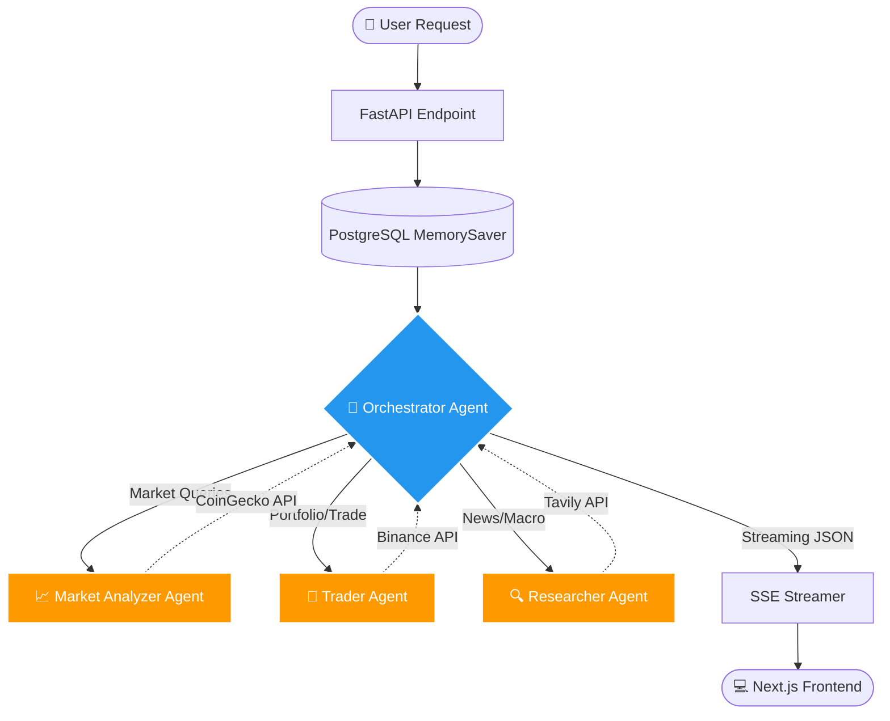
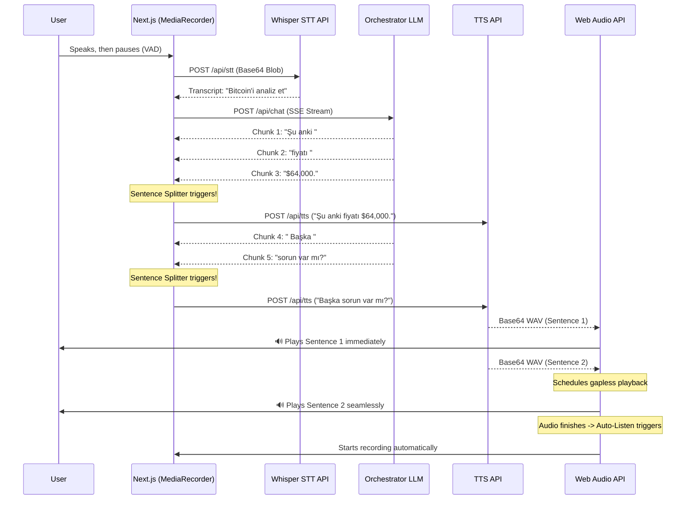

<div align="center">
  <h1>🚀 TradeSwarm AI</h1>
  <p><strong>Advanced Multi-Agent Crypto Trading & Market Intelligence Platform</strong></p>
  
  [](https://python.org)
  [](https://fastapi.tiangolo.com)
  [](https://nextjs.org)
  [](https://python.langchain.com/docs/langgraph/)
  [](https://docker.com)
</div>

<br />

TradeSwarm is an enterprise-grade, **multi-agent AI system** designed to automate and orchestrate cryptocurrency trading operations, market research, and portfolio analysis. Built on a scalable, asynchronous architecture, it interprets complex natural language commands, dynamically spawns specialized sub-agents, executes them concurrently, and streams real-time insights to a high-performance modern web interface.

This project demonstrates expertise in **AI orchestration, real-time data streaming (SSE), modern full-stack development, and distributed systems architecture.**

---

## 📸 Demo

### Multi-Agent Research in Action
The Orchestrator delegates the question to the Researcher sub-agent; its progress, tool calls and final answer stream into the chat in real time, and the chat gets an LLM-generated title when the first answer completes.

<p align="center">
  
</p>

### Hands-Free Voice Mode
ChatGPT-style voice conversation: the transcript stays on screen, the orb reacts to your voice and to the assistant's speech, and the end of your turn is detected automatically from silence — no push-to-talk. Tap the orb to interrupt.

<p align="center">
  
</p>

### Inline Dictation
Speak into the composer, confirm with ✓, and edit the transcript before sending.

<p align="center">
  
</p>

## 🌟 Key Highlights & Engineering Achievements

*   **Orchestrator-Worker Multi-Agent Architecture (LangGraph):** Employs a robust Supervisor-Worker pattern. A central Orchestrator LLM intelligently delegates sub-tasks (e.g., market analysis, portfolio checks) to specialized sub-agents. These agents run concurrently, vastly reducing overall latency.
*   **Gapless Real-Time Voice Chat (Web Audio API):** Features a fully hands-free, ChatGPT-style voice mode with silence-based end-of-turn detection, plus inline dictation in the composer. It uses MediaRecorder for STT, custom streaming text chunking algorithms for the LLM response, and the **Web Audio API (`AudioBufferSourceNode`)** to achieve zero-latency, gapless Text-to-Speech (TTS) playback—a significant upgrade over standard HTML5 audio players.
*   **True Real-Time Streaming UI (Server-Sent Events):** The backend streams execution traces, intermediate tool calls, agent reasoning steps, and final tokens to the client asynchronously. The Next.js frontend reconstructs this state tree dynamically in real-time.
*   **Production-Ready Modern Frontend:** Built with **Next.js 15 (App Router)**, React 19, and Tailwind CSS v3. Features a highly modular component architecture utilizing **shadcn/ui**, `framer-motion` for smooth layout transitions, and comprehensive state management via custom React hooks.
*   **Persistent Contextual Memory:** Utilizes PostgreSQL with asynchronous SQLAlchemy to persistently store conversational state, UI events, and session metadata, enabling the LLM to retain long-term context seamlessly.

## 🏗 System Architecture & Workflows

TradeSwarm is composed of two decoupled services communicating over REST and SSE, fully containerized via Docker.

### 1. Agentic Workflow (LangGraph Architecture)

The core intelligence is driven by a stateful multi-agent graph. Unlike traditional linear LLM chains, TradeSwarm uses a **Supervisor-Worker routing mechanism**. The Orchestrator decides *which* specialized sub-agent to invoke, and can run them in parallel to aggregate complex data before delivering a final verdict.



### 2. Gapless Real-Time Voice Chat Pipeline (STT & TTS)

Achieving a native-feeling, hands-free voice interface in the browser requires bypassing traditional HTML5 audio limitations. We implemented a custom Voice Chat pipeline using the **Web Audio API** and a proprietary **Streaming Sentence Splitter**.

**How it works:**
1. **STT (Speech-to-Text):** The browser records via `MediaRecorder` while a lightweight voice activity detector (RMS level with an adaptive noise floor) watches the mic. After ~1.1s of silence following speech, the BLOB is base64 encoded and sent to the backend `Whisper API` via OpenRouter.
2. **LLM Generation:** The text is fed to the Orchestrator, which starts streaming chunks (tokens).
3. **Chunking & TTS (Text-to-Speech):** As tokens arrive on the client, our `StreamingSentenceSplitter` buffers them. As soon as a full sentence is formed (detecting punctuation without breaking decimals like `$45.50`), it triggers a background TTS fetch.
4. **Gapless Playback:** Base64 WAV files arrive out of order. The `useGaplessAudio` hook decodes them into `AudioBuffer` objects and precisely schedules their playback times using `AudioBufferSourceNode.start(scheduledTime)`, eliminating the 100-250ms gap typical of standard `Audio` elements.



### 3. Frontend (Next.js / React / Tailwind)
- **Framework:** Next.js 15 (App Router) ensuring optimal chunking and fast initial load times.
- **State Management:** Complex React hooks (`useVoiceChat`, `useChatStream`, `useGaplessAudio`) to manage the heavily asynchronous and event-driven nature of the LLM stream.
- **UI/UX:** Vercel AI Chatbot-inspired design. Implements Dark/Light mode (`next-themes`), highly customized Markdown rendering (syntax highlighting, GFM), and collapsible reasoning blocks for Chain-of-Thought transparency.

## 🚀 Quick Start Guide

The entire stack is containerized for reproducibility and ease of deployment.

### Prerequisites
- Docker & Docker Compose
- Node.js (Only if running frontend outside of Docker for development)

### 1. Environment Configuration
Create a `.env` file in the root directory. Configure your AI providers (OpenRouter/OpenAI), Database credentials, and 3rd party APIs (Binance, CoinGecko, Tavily). *Refer to `.env.example` for the exact schema.*

### 2. Launch the Swarm
```bash
# Build and start the PostgreSQL database, FastAPI backend, and Next.js frontend
docker-compose up -d --build
```

### 3. Access the Application
- **Frontend UI:** `http://localhost:3000`
- **Backend API Docs (Swagger):** `http://localhost:8000/docs`

## 🧠 Technical Deep-Dive: Event Streaming & UI Hydration

One of the most complex engineering challenges in this project was mapping the deeply nested, asynchronous tool-call graph of LangChain to a flat React UI. 

**The Solution:**
1. The FastAPI backend intercepts `astream_events` from the LangGraph checkpointer.
2. It flattens these into distinct `UIEvent` types (`tool_start`, `sub_agent_start`, `reasoning`, `content`, `done`).
3. Each event carries `run_id` and `parent_ids`.
4. The React frontend (`useChatStream` hook) consumes the SSE stream, reducing the events into a structured `MessageGroup` object.
5. React deeply re-renders only the specific `MessageBubble` or `SubAgentCard` associated with the currently executing `run_id`, showing spinners for active tools and checkmarks for completed ones, all in real-time.

## 🤝 Let's Connect

I am actively looking for roles where I can leverage my expertise in **AI Engineering, Full-Stack Development, and Systems Architecture** to build impactful, scalable products. 

If you're an engineering manager or technical recruiter looking for a developer who understands both the complex backend orchestration of LLMs and the nuances of building a butter-smooth frontend user experience—let's talk!