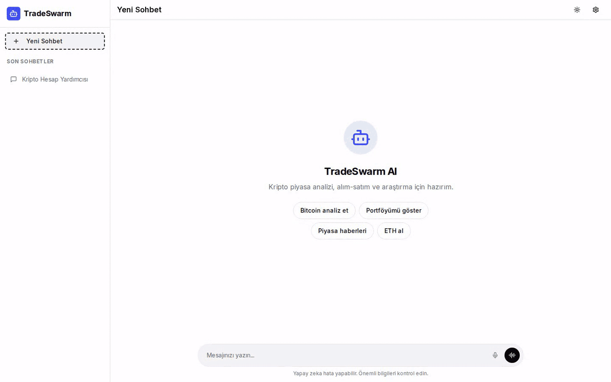
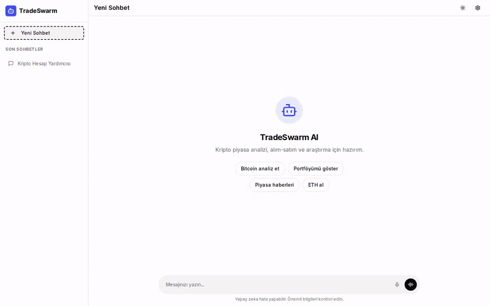
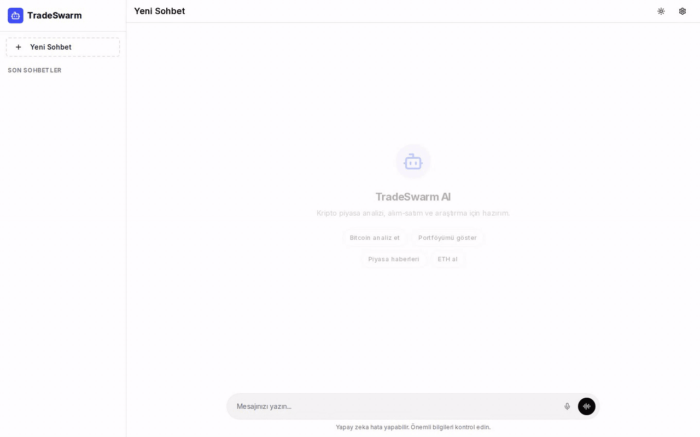
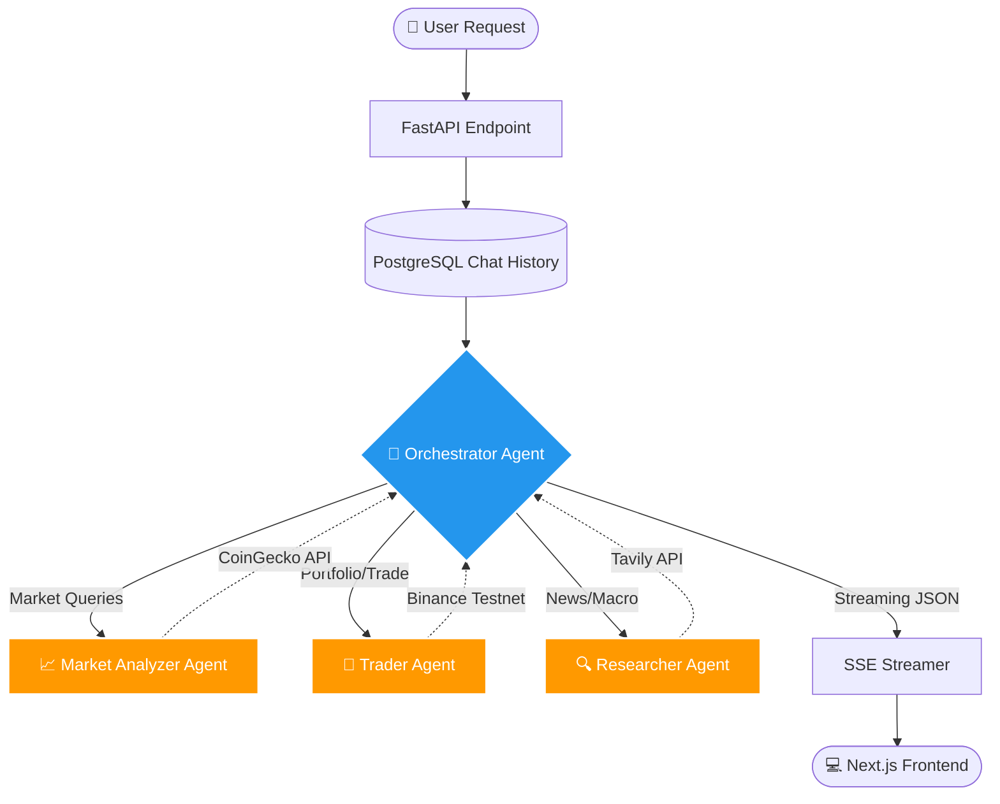
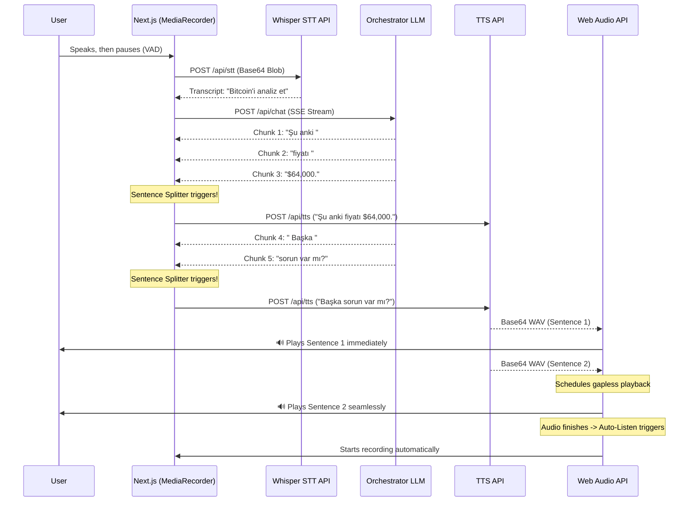

<div align="center">
  <h1>🚀 TradeSwarm AI</h1>
  <p><strong>Advanced Multi-Agent Crypto Trading & Market Intelligence Platform</strong></p>

  [](https://python.org)
  [](https://fastapi.tiangolo.com)
  [](https://nextjs.org)
  [](https://python.langchain.com/docs/langgraph/)
  [](https://docker.com)
</div>

<br />

TradeSwarm is a **multi-agent AI system** for cryptocurrency trading, market research, and portfolio analysis. An Orchestrator agent interprets natural-language requests (typed or spoken), delegates work to specialized sub-agents, and streams every step — reasoning, tool calls, sub-agent output and the final answer — to a Next.js interface in real time.

> **Safe by design:** the Trader agent executes orders on the **Binance Spot Testnet**, so no real funds are ever at risk. Every order and cancellation also waits for your explicit approval in the chat (human-in-the-loop). Set `TRADING_ENABLED=false` to make it read-only.

This project focuses on **AI agent orchestration, real-time streaming (SSE), voice interfaces, and full-stack development.**

---

## 📸 Demo

### Multi-Agent Research in Action
The Orchestrator delegates the question to the Researcher sub-agent; its progress, tool calls and final answer stream into the chat in real time, and the chat gets an LLM-generated title when the first answer completes.

<p align="center">
  
</p>

### Hands-Free Voice Mode
ChatGPT-style voice conversation: the transcript stays on screen, the orb reacts to your voice and to the assistant's speech, and the end of your turn is detected automatically from silence — no push-to-talk. Tap the orb to interrupt.

<p align="center">
  
</p>

### Inline Dictation
Speak into the composer, confirm with ✓, and edit the transcript before sending.

<p align="center">
  
</p>

## 🌟 Key Highlights & Engineering Achievements

*   **Orchestrator-Worker Multi-Agent Architecture (LangGraph):** Employs a robust Supervisor-Worker pattern. A central Orchestrator LLM intelligently delegates sub-tasks (e.g., market analysis, portfolio checks) to specialized sub-agents. When a request needs several of them, their tool calls run in parallel.
*   **Gapless Real-Time Voice Chat (Web Audio API):** Features a fully hands-free, ChatGPT-style voice mode with silence-based end-of-turn detection, plus inline dictation in the composer. It uses MediaRecorder for STT, custom streaming text chunking algorithms for the LLM response, and the **Web Audio API (`AudioBufferSourceNode`)** to play Text-to-Speech (TTS) sentence by sentence without gaps, so the assistant starts speaking before the full answer is generated.
*   **True Real-Time Streaming UI (Server-Sent Events):** The backend streams execution traces, intermediate tool calls, agent reasoning steps, and final tokens to the client asynchronously. The Next.js frontend reconstructs this state tree dynamically in real-time.
*   **Modern Frontend:** Built with **Next.js 15 (App Router)**, React 19, and Tailwind CSS v3. Uses a modular component architecture with **shadcn/ui**, `framer-motion` for smooth layout transitions, and comprehensive state management via custom React hooks.
*   **Persistent Chat History:** PostgreSQL (async SQLAlchemy) stores messages, UI events and sessions, so conversations — including tool calls and sub-agent cards — are fully restored after a reload or restart, and chats get an LLM-generated title.
*   **Human-in-the-Loop Order Approval:** Before the Trader places or cancels an order, the tool pauses and an approval card with the exact symbol, side, quantity and prices appears in the chat. Nothing is sent to the exchange unless you click *Approve*; rejecting, letting the 120-second window expire, or stopping the request leaves the account untouched.
*   **Secured API:** All endpoints except login are protected with JWT authentication.

## 🤖 Agents & Tools

TradeSwarm uses a **supervisor–worker** hierarchy: the Orchestrator talks to the user and delegates; each sub-agent is a specialist with its own tools and returns a structured report to the Orchestrator, which writes the final answer. Sub-agents never talk to the user directly.

| Agent | Responsibility | Data source | Model (`.env`) | Tools |
|---|---|---|---|---|
| 🧠 **Orchestrator** | Understands the request, picks and calls sub-agents (in parallel when needed), merges their reports into the final answer | Sub-agents | `ORCHESTRATOR_MODEL` | 5 |
| 💼 **Trader** | Balances, prices, order book and order management | Binance Spot **Testnet** | `SUB_AGENT_MODEL` | 11 |
| 🔍 **Researcher** | News, project fundamentals and macro developments from the web | Tavily | `SUB_AGENT_MODEL` | 2 |
| 📈 **Market Analyzer** | Prices, market data, exchange listings, trends and corporate holdings | CoinGecko | `SUB_AGENT_MODEL` | 8 |

⚠️ marks tools that change state (orders, chat title) or send something outside the app. 🛡️ marks tools that only run after you approve them in the chat.

<details>
<summary><strong>🧠 Orchestrator</strong> — 5 tools</summary>

| Tool | What it does |
|---|---|
| `ask_trader(query)` | Delegates trading, balance and order requests to the Trader agent |
| `ask_researcher(query)` | Delegates news and web research to the Researcher agent |
| `ask_market_analyzer(query)` | Delegates price, market and statistics questions to the Market Analyzer agent |
| `update_chat_title(new_title)` ⚠️ | Renames the current chat when the topic changes or the user asks |
| `notify_user(message)` ⚠️ | Sends a summary of key analyses or executed trades to the user via Telegram |

</details>

<details>
<summary><strong>💼 Trader</strong> (Binance Spot Testnet) — 11 tools</summary>

| Tool | What it does |
|---|---|
| `get_exchange_info(symbol)` | Trading rules for a pair (min quantity, price/lot step) |
| `get_symbol_price(symbol)` | Current price of a pair, or of the whole market with `ALL` |
| `get_klines(symbol, interval, limit)` | Historical candlesticks (`1m`, `1h`, `1d`, …) |
| `get_order_book(symbol, limit)` | Order book depth: bids and asks |
| `get_account_balance(asset)` | Account balances, optionally for a single asset |
| `get_my_trades(symbol, limit)` | Your past trades for a pair |
| `get_open_orders(symbol)` | Open orders, optionally filtered by pair |
| `create_market_order(symbol, side, quantity)` ⚠️ 🛡️ | Places a market BUY/SELL order |
| `create_limit_order(symbol, side, quantity, price)` ⚠️ 🛡️ | Places a limit order at a given price |
| `create_oco_order(symbol, side, quantity, price, stop_price, stop_limit_price)` ⚠️ 🛡️ | Places an OCO order (take-profit + stop-loss together) |
| `cancel_open_order(symbol, order_id)` ⚠️ 🛡️ | Cancels an open order by ID |

</details>

<details>
<summary><strong>🔍 Researcher</strong> (Tavily) — 2 tools</summary>

| Tool | What it does |
|---|---|
| `search_market_news(query)` | Searches the web for up-to-date crypto news, project updates and macro developments |
| `extract_webpage_content(urls)` | Extracts the full text of up to 3 pages to read an article in depth |

The Researcher is instructed to use only what it found, cite its sources, and say so when it finds nothing instead of guessing.

</details>

<details>
<summary><strong>📈 Market Analyzer</strong> (CoinGecko) — 8 tools</summary>

| Tool | What it does |
|---|---|
| `get_simple_price(coin_ids, vs_currencies)` | Current prices for one or more coins |
| `get_coin_details(coin_id)` | Market cap, developer (GitHub) activity and community data |
| `get_coin_exchanges(coin_id, limit)` | Exchanges and pairs a coin trades on, with volumes |
| `get_historical_price(coin_id, date_dd_mm_yyyy)` | Price and market cap on a past date |
| `get_category_coins(category_id, limit)` | Top coins in a category (e.g. `artificial-intelligence`, `meme-token`) |
| `get_global_market_data()` | Total market cap, BTC dominance and other macro figures |
| `get_trending_search()` | Top 7 trending coins on CoinGecko |
| `get_public_treasury(coin_id)` | BTC/ETH held by public companies (e.g. MicroStrategy, Tesla) |

</details>

## 🏗 System Architecture & Workflows

TradeSwarm consists of a FastAPI backend, a Next.js frontend and PostgreSQL, communicating over REST and SSE and containerized with Docker Compose.

### 1. Agentic Workflow (LangGraph Architecture)

The core intelligence is driven by a stateful multi-agent graph. Unlike traditional linear LLM chains, TradeSwarm uses a **Supervisor-Worker routing mechanism**. The Orchestrator decides *which* specialized sub-agent to invoke, and can run them in parallel to aggregate complex data before delivering a final verdict.



### 2. Gapless Real-Time Voice Chat Pipeline (STT & TTS)

Achieving a native-feeling, hands-free voice interface in the browser requires bypassing traditional HTML5 audio limitations. It is built on the **Web Audio API** and a custom **Streaming Sentence Splitter**.

**How it works:**
1. **STT (Speech-to-Text):** The browser records via `MediaRecorder` while a lightweight voice activity detector (RMS level with an adaptive noise floor) watches the mic. After ~1.1s of silence following speech, the BLOB is base64 encoded and sent to the backend `Whisper API` via OpenRouter.
2. **LLM Generation:** The text is fed to the Orchestrator, which starts streaming chunks (tokens).
3. **Chunking & TTS (Text-to-Speech):** As tokens arrive on the client, our `StreamingSentenceSplitter` buffers them. As soon as a full sentence is formed (detecting punctuation without breaking decimals like `$45.50`), it triggers a background TTS fetch.
4. **Gapless Playback:** Base64 WAV files arrive out of order. The `useGaplessAudio` hook decodes them into `AudioBuffer` objects and precisely schedules their playback times using `AudioBufferSourceNode.start(scheduledTime)`, eliminating the 100-250ms gap typical of standard `Audio` elements.



### 3. Frontend (Next.js / React / Tailwind)
- **Framework:** Next.js 15 (App Router) with React 19.
- **State Management:** Custom React hooks (`useChatStream`, `useVoiceChat`, `useDictation`, `useGaplessAudio`) manage the asynchronous, event-driven LLM stream and audio pipeline.
- **UI/UX:** ChatGPT-inspired design with Dark/Light mode (`next-themes`), Markdown rendering (syntax highlighting, GFM tables), and collapsible reasoning blocks that expose the model's chain of thought.

## 🚀 Quick Start Guide

The entire stack is containerized for reproducibility and ease of deployment.

### Prerequisites
- Docker & Docker Compose
- An [OpenRouter](https://openrouter.ai) API key (LLMs, Whisper STT and TTS)
- Optional, per feature: [Tavily](https://tavily.com) (Researcher), [CoinGecko](https://www.coingecko.com/en/api) (Market Analyzer), [Binance Spot Testnet](https://testnet.binance.vision) keys (Trader), a Telegram bot (notifications)

### 1. Clone & Configure
```bash
git clone https://github.com/emrullahccelik/TradeSwarm.git
cd TradeSwarm
cp .env.example .env
```
Fill in `.env`. At minimum set `API_AUTH_KEY` (your login password), `JWT_SECRET` (token signing key) and the `ORCHESTRATOR_*`, `SUB_AGENT_*` and `TITLE_*` keys; add `STT_API_KEY` for voice mode and dictation.

### 2. Launch
```bash
# Builds and starts PostgreSQL, the FastAPI backend and the Next.js frontend
docker compose up -d --build
```

### 3. Open the App
Go to **http://localhost:3000** and sign in with your `API_AUTH_KEY`.

### Running Tests
```bash
pip install -r requirements-dev.txt
pytest tests
```
The tests mock every external service (Binance, Tavily, LLMs), so no API keys or database are needed.

## 🧠 Technical Deep-Dive: Event Streaming & UI Hydration

One of the main engineering challenges in this project was mapping LangGraph's deeply nested, asynchronous run tree (orchestrator → sub-agent → tools) to a readable chat UI.

**The Solution:**
1. The FastAPI backend consumes LangGraph's `astream_events` (v2) and flattens them into a small set of `UIEvent` types: `reasoning`, `content`, `tool_start`/`tool_end`, `sub_agent_start`/`sub_agent_end`, `done` and `error`.
2. Every event carries its `run_id` and `parent_ids`; text streamed by a sub-agent is tagged with that sub-agent's run id so it never leaks into the main answer.
3. The frontend turns the event list into a **chronological timeline**: reasoning blocks, tool badges, sub-agent cards and answer text appear in the order they happened. Events whose `parent_ids` contain a running sub-agent are attached to that agent's card.
4. The same event list is persisted with each message, so a reloaded conversation renders exactly like the live one.
5. **Order approval:** order tools run inside the Trader's worker thread, several layers below the request. They publish an `approval_required` custom event (which `astream_events` surfaces to the SSE stream like any other event) and block until `POST /api/approvals/{id}` delivers the user's decision. An `approval_resolved` event records the outcome, and when a request ends or is cancelled, its pending approvals are rejected so a tool can never be left waiting. Pending approvals live in process memory, so the backend runs as a single worker.
6. The stream is resilient: if the connection drops before `done`, the UI unlocks and shows an error instead of hanging, and a cancelled request still saves the partial answer.
